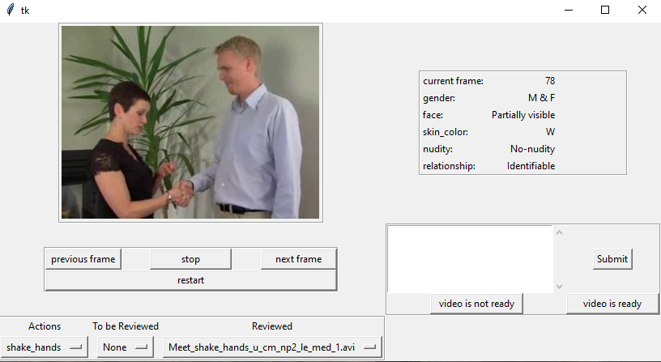

# PA-HMDB51 GUI
To view frame-wise annotated privacy attributes of each video.

## Download Datasets
* Download the original HMDB51 videos from the [official website](https://serre-lab.clps.brown.edu/resource/hmdb-a-large-human-motion-database/). 
Save the original HMDB51 videos in folder `<hmdb51_video_root_dir>` (e.g., `./hmdb51_org`).

* Download PA-HMDB51 labels from [Google Drive](https://drive.google.com/drive/u/1/folders/1NH71LxF3rTwTSnxXcA3Wy8GOn6JluGNr) or 
[Github](https://github.com/VITA-Group/PA-HMDB51/tree/master/PrivacyAttributes). 
Save the privacy attribute labels in folder `<PA_label_root_dir>` (e.g., `./HMDB51_PrivacyAttributes`).

## Running the GUI
* Run `python Review.py --vd <hmdb51_video_root_dir> --pd <PA_label_root_dir>` to launch the GUI.

* Select an action from the dropdown menu named "Actions", and then select a video from the dropdown menu named "To be Reviewed" or "Reviewed".

* Use the video control buttons ("previous frame", "next frame", "start/stop", "restart") to check the labels of each frame.

## Acknowledgements
The authors would like to sincerely thank [Scott Hoang](https://github.com/ScottHoang) for his contributions in building this GUI.
